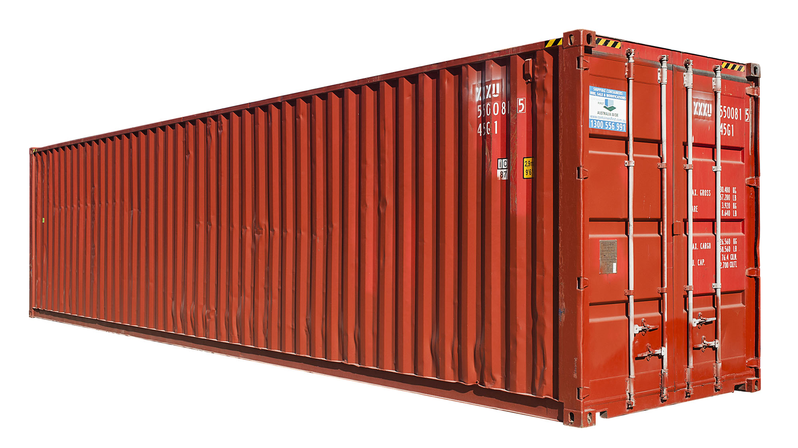

# Containers: Singularity

---

# Agenda

---

1. What is a container
2. Brief history of virtualisation
3. Docker
4. Why Docker is not suitable for HPC
5. Some of the available solutions for HPC
6. Singularity
7. Examples of functionality

---

# Containers

- are encapsulations of system environments (software, libraries, etc…)
- allow portability of workflows between resources
- are lightweight and introduce little overhead

---

# History

Virtual machines (70-80's) - introduced the exciting reality than an entire environment, including software dependencies, libraries, runtime code, and data, could be encapsulated and run anywhere.

Virtual machines, however, also introduced large computational overhead due to the required level of virtualization for emulating the OS and kernel.

With the addition of lightweight virtualization features to the Linux kernel (around 2002) (e.g., namespaces, cgroups, seccomp-bpf) a new lightweight virtualization, containers, became possible to implement.

---

# Docker

it’s just processes running in the same Linux kernel:

namespaces (Mount, Process ID, Network, User ID): isolates processes from the rest of the system, without needing to use full low level virtualization technology.
cgroups: resource limits
seccomp-bpf: filters which system calls your processes can run

Implementations such as Docker, one of the container solutions made open source in 2013, offered additional improvements over standard virtual machines. Containers could share resources with the host without incurring much of the performance penalties of hardware-level virtualization.

https://jvns.ca/blog/2016/10/10/what-even-is-a-container/

---

# Docker on Windows and MacOS

How does Docker work on Windows?

Docker for Windows still uses a Linux VM to run Linux containers. But instead of using Virtual Box (which is what is used with Docker Toolbox), the Linux VM is run using Hyper-V - a Windows-native hypervisor.

How does Docker work on MacOS?

Docker Desktop for Mac uses HyperKit instead of Virtual Box. Hyperkit is a lightweight macOS virtualization solution built on top of Hypervisor.framework in macOS 10.10 Yosemite and higher.

A hypervisor is a process that separates a computer's operating system and applications from the underlying physical hardware.

---

# Why Docker is not a (the) solution for HPC

Docker is the industry standard for micro-service virtualization and it is a fantastic solution for this need, but unfortunately does not meet the requirements for widespread scientific computational usage quite as well.

- Security

From an IT security perspective, a machine can be considered compromised if any user is able to run arbitrary code as the root use.

While Docker takes steps to mitigate the risk of allowing users to run arbitrary code, there is a fatal design flaw that limits Docker’s ability to run in HPC environments: for every container that Docker runs, the container process is spawned as a child of a root owned Docker daemon. As the user is able to directly interact with and control the Docker daemon, it is theoretically possible to coerce the daemon process into granting the users escalated privileges. Any user being able to escalate up to system administrator status, a user called “root”, would introduce unthinkable security risks for a shared compute environment.

---

# Some of the other available solutions for HPC

Available container solutions:

- Software modules (user interface to manipulate paths to executables that can be found)

- Package managers (perform installation to a location given that the user has write permission to that location.)

Modules and package managers make installation easy, however they are not portable environments in that they can encapsulate a workflow, data, and the entire operating system itself

---

# To sum up:

- Virtual machines -> overheads

- Docker -> security

- Software modules, Package managers -> not portable environments

---

# Honourable mentions for HPC:

- CharlieCloud

- Shifter

Shifter and CharlieCloud are designed to work with (but modify) Docker containers and its setup and management is a non-trivial task.

---
# Singularity

- Mobility of compute

Singularity achieves this by utilizing a distributable image format that encapsulates the entire container and stack into a single image file.

- Reproducibility

Once a contained workflow has been defined, the container image can be snapshotted, archived, and locked down such that it can be used later and the user can be confident that the code within the container has not changed.

- User freedom

Singularity can give the user the freedom they need to install the applications, versions, and dependencies for their workflows without impacting the system in any way.

- Support on HPC machines

The goal of Singularity is to support existing and traditional HPC resources as easily as installing a single package onto the host operating system. For the administrators of the hosts, some configuration may be required via a single configuration file, however the default values are tuned to be generally applicable for shared environments.

- Singularity can run (only) on host Linux distributions
- Singularity natively supports technologies such as InfiniBand
and Lustre, while at the same time integrating seamlessly with any resource manager

---
# Singularity in action

- Docker

- Recipe file

- Local / HPC

---
